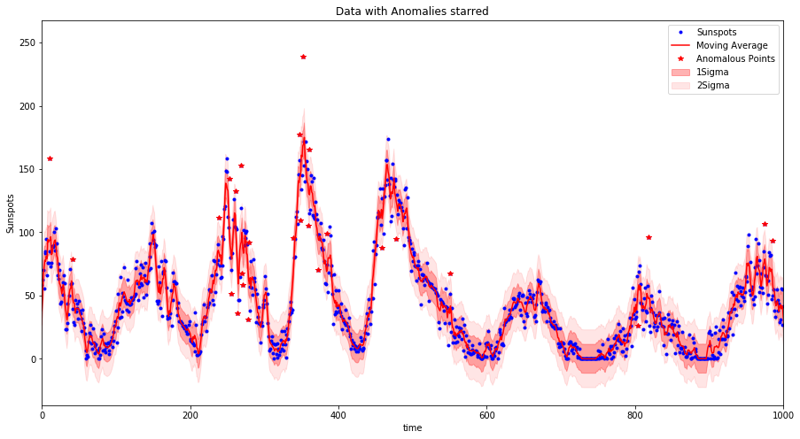

# Time series Anomaly detection

This is a times series anomaly detection algorithm implementation.  It is used to catch multiple anomalies based on your time series data dependent on the confidence level you wish to set.

The anom_detect.py can be downloaded and imported, alternatively you can follow the Jupyter notebook to look at an example implementation, in particular it is important to check for normality of the data in order to use this method.  The result of implementing this method is the generation of plots (shown below) and tables displaying the detected anomalies in your data.

As a general suggestion to anomaly detection is you should to get to know your data.  This method is a simple implementation looking to see if the deviation of a point from the trend of the data is explained by the variation of the dataset or not.  The selection of the signficance levels is dependent also on your ability to process anomalous points.

## Implementation
The algorithm computes a moving average based on a certain window size.  The moving average method used implements a simple low pass filter (using discrete linear convolution).  This sounds complicated but it is not so bad (I will upload a blog to explain), it is nicer than rolling average methods which don't deal with boundaries of your data very well (early time data not properly averaged).  
Then using the moving average as the trend of the data each points deviation from the moving average is calculated and then the generalized extreme Studentized deviate (ESD) test - an extension of the Grubbs test to multiple anomalies - is used to evaluate the actual data points to identify if they are likely to be anomalous dependent on a user set confidence level (alpha).

### Python Requirements
- Python 3
- Scipy
- numpy
- pandas
- matplotlib

### Improvements to be made
- Treatment of sparse or missing time periods.  At the moment it is believed that the data is continuous.  If for example there are 300 consecutive days of data followed by 60 days of no data and then another 300 days of data, the current implementation will treat the data as 600 consecutive points.  Meaning the trends of the initial 300 days will impact on the events 60 days afterwards.  
This will be corrected by implementing a gap detector, identifying gaps in the data which are greater than the size of the window.

### Weakness in Approach
The use of a moving average is a simplistic approach and masks any continuous underlying trends such time dependent trends where STL methods may be more appropriate.
In addition the use of ESD requires that the data be approximately normally distributed, this should be tested to ensure that this method is the correct application.  

## References
[1] Generalized ESD Test for Outliers, http://www.itl.nist.gov/div898/handbook/eda/section3/eda35h3.htm

[2] Convolution Implementation, https://docs.scipy.org/doc/numpy-1.13.0/reference/generated/numpy.convolve.html

[3] STL method, http://www.statsmodels.org/stable/generated/statsmodels.tsa.seasonal.seasonal_decompose.html?highlight=seasonal

[4] Introducing practical and robust anomaly detection in a time series, https://blog.twitter.com/engineering/en_us/a/2015/introducing-practical-and-robust-anomaly-detection-in-a-time-series.html
